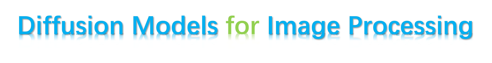

  

**Purpose**: We aim to provide a summary of diffusion model-based image processing, including restoration, enhancement, coding, and quality assessment. More papers will be summarized.

[Xin Li](http://home.ustc.edu.cn/~lixin666/), [Yulin Ren](), [Xin Jin](http://home.ustc.edu.cn/~jinxustc/), [Cuiling Lan](https://scholar.google.com/citations?user=XZugqiwAAAAJ&hl=en), [Xingrui Wang](), [Wenjun Zeng](https://scholar.google.com/citations?user=_cUfvYQAAAAJ&hl=en), [Xinchao Wang](https://scholar.google.com/citations?user=w69Buq0AAAAJ&hl=en), [Zhibo Chen](https://scholar.google.com/citations?user=1ayDJfsAAAAJ&hl=en)

University of Science and Technology of China (USTC), National University of Singapore (NUS), Microsoft Research Asia (MSRA), Eastern Institute of Technology (EIT) 

**Brief intro**: The survey for diffusion model-based IR has been released.

## 🌟  Features
- [x] **Survey for diffusion model-based Image Restoration** (Arxiv version is released) 
- [ ] Summary for diffusion model-based Image/Video Compression
- [ ] Summary for diffusion model-based Quality Assessment

## Diffusion model-based Image Restoration/Enhancement
### Table of contents
<!-- - [Survey paper](#survey-paper)
- [Table of contents](#table-of-contents) -->
- [Diffusion Model for Image Super resolution](#Image-super-resolution)
- [Diffusion model for Image Denoising](#Image-Denoising)
- [Diffusion Model for Image Deblurring](#Image-Deblurring)
- [Diffusion Model for Image Inpainting](#Image-Inpainting)
- [Diffusion model for Image Shadow Removal](#Image-Shadow-Removal)
- [Diffusion model for Multi-task IR](#Image-Multitask-Restoration)
- [Diffusion model for Blind IR](#deep-face-deblurring)
- [Diffusion model for Medical IR](#Medical-Image-Restoration)
- [Diffusion model for other tasks](#other-tasks)
- [Benchmark Datasets](#benchmark-datasets)
  - [Recommended Datasets](#recommended-datasets)
  - [All Datasets](#all-datasets)

### Image Super-Resolution
| Paper | First Author | Training Way | Venue | Topic | Project |
| :--- | :---: | :--: | :--: |:--: | :--: |
| [Image super-resolution via iterative refinement](https://ieeexplore.ieee.org/document/9887996x) | Chitwan Saharia | Supervised |TPAMI2022 | Ima ge Super-resolution | [Github](https://github.com/Janspiry/Image-Super-Resolution-via-Iterative-Refinement) |
| [Srdiff: Single image superresolution with diffusion probabilistic models](https://arxiv.org/abs/2104.14951) | Haoying Li | Supervised | Neurocomputing 2022 | Image Super-resolution | [Github](https://github.com/LeiaLi/SRDiff) |
| [CDPMSR: Conditional Diffusion Probabilistic Models for Single Image Super-Resolution](https://arxiv.org/abs/2302.12831c) | Axi Niu | Supervised | Preprint'23 | Image Super-resolution | |
| [Resdiff: Combining cnn and diffusion model for image superresolution](https://arxiv.org/abs/2303.08714) | Shuyao Shang | Supervised | Preprint'23 | Image Super-resolution | |
| [Face super-resolution using stochastic differential equations](https://arxiv.org/abs/2209.12064) | Marcelo dos Santos | Supervised | SIBGRAPI 2022 | Image Super-resolution | [Github](https://github.com/marcelowds/sr-sde) |
| [Implicit diffusion models for continuous super-resolution](https://openaccess.thecvf.com/content/CVPR2023/papers/Gao_Implicit_Diffusion_Models_for_Continuous_Super-Resolution_CVPR_2023_paper.pdf) | Sicheng Gao |  | CVPR2023 | Image Restoration | [Github](https://github.com/Ree1s/IDM) |
| [Diffir: Efficient diffusion model for image restoration](https://arxiv.org/abs/2303.09472) | Bin Xia | Supervised | Preprint'23 | Image Super-resolution | |
| [Restoring vision in adverse weather conditions with patch-based denoising diffusion models](https://arxiv.org/abs/2207.14626) | Ozan Özdenizci | Supervised | TPAMI2022 | Multi-task Restoration | [Github](https://github.com/IGITUGraz/WeatherDiffusion) |
| [Cascaded Diffusion Models for High Fidelity Image Generation](https://arxiv.org/abs/2106.15282) | Jonathan Ho | Supervised | J.Mach.Learn.Res.2022 | Image Super-resolution | |
| [RainDiffusion: When Unsupervised Learning Meets Diffusion Models for Real-world Image Deraining](https://arxiv.org/abs/2301.09430) | Mingqiang Wei | Supervised | Preprint'23 | Image Deraining| |
| [Inversion by direct iteration: An alternative to denoising diffusion for image restoration](https://arxiv.org/abs/2303.11435) | Mauricio Delbracio | Supervised | Preprint'22 | Multi-task Restoration | |
### Image Denosing
| [Diffusion model for generative image denoising](https://arxiv.org/abs/2302.02398) | Yutong Xie | Supervised | Preprint'23 | Image Denoising | |
| [Score-Based Diffusion Models as Principled Priors for Inverse Imaging](https://arxiv.org/abs/2304.11751) | Berthy T. Feng | Zero-shot | PrePrint'23 | Image Denoising, Image Deblurring | |
### Image Deblurring
| [Deblurring via stochastic refinement](https://openaccess.thecvf.com/content/CVPR2022/papers/Whang_Deblurring_via_Stochastic_Refinement_CVPR_2022_paper.pdf) | Jay Whang| Supervised | CVPR2022 | Image Deblurring | |
| [Score-Based Diffusion Models as Principled Priors for Inverse Imaging](https://arxiv.org/abs/2304.11751) | Berthy T. Feng | Zero-shot | PrePrint'23 | Image Denoising, Image Deblurring | |
### Image Inpainting
| [Repaint: Inpainting using denoising diffusion probabilistic models](https://openaccess.thecvf.com/content/CVPR2022/papers/Lugmayr_RePaint_Inpainting_Using_Denoising_Diffusion_Probabilistic_Models_CVPR_2022_paper.pdf) | Andreas Lugmayr  | Zero-shot | CVPR2022 | Image Inpainting | [Github](https://github.com/andreas128/RePaint) | 
| [Towards coherent image inpainting using denoising diffusion implicit models](https://arxiv.org/abs/2304.03322) | Guanhua Zhang | Zero-shot | PrePrint'23 | Image Inpainting | [Github](https://github.com/UCSB-NLP-Chang/CoPaint) |
### Image Shadow Removal 
| [DeS3: Attention-driven Self and Soft Shadow Removal using ViT Similarity and Color Convergence](https://arxiv.org/abs/2211.08089) | Yeying Jin | Supervised | Preprint'23 | Image Shadow Removal | |
| [Shadowdiffusion: When degradation prior meets diffusion model for shadow removal](https://openaccess.thecvf.com/content/CVPR2023/papers/Guo_ShadowDiffusion_When_Degradation_Prior_Meets_Diffusion_Model_for_Shadow_Removal_CVPR_2023_paper.pdf) | Lanqing Guo | Supervised | CVPR2023 | Image Shadow Removal |[Github](https://github.com/GuoLanqing/ShadowDiffusion) |
### Image Multi-task Restoration
| [Palette: Image-toimage diffusion models](https://arxiv.org/abs/2111.05826) | Chitwan Saharia | Supervised | SIGGRAPH 2022 | Multi-task Restoration | [Github](https://github.com/Janspiry/Palette-Image-to-Image-Diffusion-Models) |
| [Refusion: Enabling large-size realistic image restoration with latent-space diffusion models](https://arxiv.org/abs/2304.08291) | Ziwei Luo | Supervised | CVPRW 2023 | Multi-task Restoration | |
| [Image Restoration with Mean-Reverting Stochastic Differential Equations](https://arxiv.org/abs/2301.11699) | Ziwei Luo | Supervised | ICML 2023 | Multi-task Restoration | [Github](https://github.com/Algolzw/image-restoration-sde) |
| [Sud ˆ2: Supervision by denoising diffusion models for image reconstruction](https://arxiv.org/abs/2303.09642) | Matthew A. Chan | Supervised | Preprint'23 | Multi-task Restoration | |
| [Ilvr: Conditioning method for denoising diffusion probabilistic models](https://openaccess.thecvf.com/content/ICCV2021/papers/Choi_ILVR_Conditioning_Method_for_Denoising_Diffusion_Probabilistic_Models_ICCV_2021_paper.pdf) | Jooyoung Choi | Zero-shot | ICCV2021 | Image Restoration | [Github](https://github.com/jychoi118/ilvr_adm) |
| [Come-closer-diffusefaster: Accelerating conditional diffusion models for inverse problems through stochastic contraction](https://openaccess.thecvf.com/content/CVPR2022/papers/Chung_Come-Closer-Diffuse-Faster_Accelerating_Conditional_Diffusion_Models_for_Inverse_Problems_Through_Stochastic_CVPR_2022_paper.pdf) | Hyungjin Chung |  | CVPR2022 | Multi-task Restoration | |
| [Snips: Solving noisy inverse problems stochastically](https://arxiv.org/abs/2105.14951) | Bahjat Kawa | Zero-shot | NeurIPS 2021 | Multi-task Restoration | [Github](https://github.com/bahjat-kawar/snips_torch)|
| [Denoising diffusion restoration models](https://arxiv.org/abs/2201.11793) | Bahjat Kawar |  | ICLR2022 | Multi-task Restoration | [Github](https://github.com/bahjat-kawar/ddrm) |
| [Zero-shot image restoration using denoising diffusion null-space model](https://arxiv.org/abs/2212.00490) | Yinhuai Wang | Zero-shot | ICLR2023 | Multi-task Restoration | [Github](https://github.com/wyhuai/DDNM) |
| [Diffusion Posterior Sampling for General Noisy Inverse Problems](https://arxiv.org/abs/2209.14687) | Hyungjin Chung | Zero-shot | ICLR 2023 | Multi-task Restoration | [Github](https://github.com/DPS2022/diffusion-posterior-sampling) |
| [Diracdiffusion: Denoising and incremental reconstruction with assured data-consistency](https://arxiv.org/abs/2303.14353) | Zalan Fabian | Zero-shot | NeurIPS 2022 | Multi-task Restoration | |
| [Pseudoinverse-guided diffusion models for inverse problems](https://openreview.net/forum?id=9_gsMA8MRKQ) | Jiaming Song | Zero-shot | ICLR 2023 | Multi-task Restoration | |
| [Generative diffusion prior for unified image restoration and enhancement](https://openaccess.thecvf.com/content/CVPR2023/papers/Fei_Generative_Diffusion_Prior_for_Unified_Image_Restoration_and_Enhancement_CVPR_2023_paper.pdf) | Ben Fei | Zero-shot | CVPR2023 | Multi-task Restoration | [Github](https://github.com/Fayeben/GenerativeDiffusionPrior) |
| [Denoising diffusion models for plug-and-play image restoration](https://openaccess.thecvf.com/content/CVPR2023W/NTIRE/papers/Zhu_Denoising_Diffusion_Models_for_Plug-and-Play_Image_Restoration_CVPRW_2023_paper.pdf) | Yuanzhi Zhu | Zero-shot | CVPR 2023 | Multi-task Restoration | [Github](https://github.com/yuanzhi-zhu/DiffPIR) |
| [A variational perspective on solving inverse problems with diffusion models](https://arxiv.org/abs/2305.04391) | Morteza Mardani | Zero-shot | PrePrint'22 | Image Inpainting, Image Super-resolution | |
### Blind Image Restoration
| [Denoising diffusion probabilistic models for robust image super-resolution in the wild](https://arxiv.org/abs/2302.07864) | Hshmat Sahak | Supervised | Preprint'23 | Blind Restoration | |
| [Driftrec: Adapting diffusion models to blind image restoration tasks](https://arxiv.org/abs/2211.06757) | Simon Welker | Supervised | Preprint'22 | Blind Restoration | |
| [Diffgar: Model-agnostic restoration from generative artifacts using image-to-image diffusion models](https://arxiv.org/abs/2210.08573) | Yueqin Yin | Supervised | Preprint'22 | Blind Restoration | |
| [Multiscale Structure Guided Diffusion for Image Deblurring](https://arxiv.org/abs/2212.01789) | Mengwei Ren | Supervised | Preprint'22 | Blind Restoration | |
| [Synthesizing realistic image restoration training pairs: A diffusion approach](https://arxiv.org/abs/2303.06994) | Tao Yang | Supervised | Preprint'22 | Image Restoration | |
| [Diffbfr: Bootstrapping diffusion model towards blind face restoration](https://arxiv.org/abs/2305.04517) | Xinmin Qiu | Supervised | Preprint'23 | Blind Restoration | |
| [Exploiting diffusion prior for real-world image super-resolution](https://arxiv.org/abs/2305.07015) | Jianyi Wang | Supervised | Preprint'23 | Blind Restoration | [Github](https://github.com/IceClear/StableSR)|
| [Difface: Blind face restoration with diffused error contraction](https://arxiv.org/abs/2212.06512) | Zongsheng Yu | Zero-shot | PrePrint'23 | Blind Restoration | [Github](https://github.com/zsyOAOA/DifFace) |
| [Dr2: Diffusion-based robust degradation remover for blind face restoration](https://openaccess.thecvf.com/content/CVPR2023/papers/Wang_DR2_Diffusion-Based_Robust_Degradation_Remover_for_Blind_Face_Restoration_CVPR_2023_paper.pdf) | Zhixin Wang | Zero-shot | CVPR2023 | Blind Restoration | |
| [Parallel diffusion models of operator and image for blind inverse problems](https://openaccess.thecvf.com/content/CVPR2023/papers/Chung_Parallel_Diffusion_Models_of_Operator_and_Image_for_Blind_Inverse_CVPR_2023_paper.pdf) | Hyungjin Chung | Zero-shot | CVPR2023 | Blind Restoration | [Github](https://github.com/BlindDPS/blind-dps) |
| [Gibbsddrm: A partially collapsed gibbs sampler for solving blind inverse problems with denoising diffusion restoration](https://arxiv.org/abs/2301.12686) | Naoki Murata | Zero-shot | PrePrint'23 | Blind Restoration | |
| [Adir: Adaptive diffusion for image reconstruction](https://arxiv.org/abs/2212.03221) | Shady Abu-Hussein | Zero-shot | PrePrint'22 | Blind Restoration | |
### Medical Restoration (MRI,CT)
| [Improving diffusion models for inverse problems using manifold constraints](https://arxiv.org/abs/2206.00941) | Hyungjin Chung | Zero-shot | NeurIPS 2022 | CT Reconstruction | [Github](https://github.com/HJ-harry/MCG_diffusion) |
| [Solving inverse problems in medical imaging with score-based generative models](https://arxiv.org/abs/2111.08005) | Yang Song | Zero-shot | ICLR 2022 | CT Reconstruction | |
| [Adaptive diffusion priors for accelerated mri reconstruction](https://arxiv.org/abs/2207.05876) | Alper Güngör | Supervised | Preprint'23 | MRI Reconstruction | |
| [High-Frequency Space Diffusion Models for Accelerated MRI](https://arxiv.org/abs/2208.05481) | Chentao Cao | Supervised | Preprint'22 | MRI Reconstruction | |
### Other tasks
| [Jpeg artifact correction using denoising diffusion restoration models](https://arxiv.org/abs/2209.11888) | Bahjat Kawar| Zero-shot | NeurIPS 2022 | JPEG Artifacts Removal | [Github](https://github.com/bahjat-kawar/ddrm-jpeg) |
| [Improved Diffusion-based Image Colorization via Piggybacked Models](https://arxiv.org/abs/2304.11105) | Hanyuan Liu | Zero-shot | PrePrint'23 | Image Colorization | [Github](https://github.com/hyliu/piggyback-color) |
| [Pyramid Diffusion Models For Low-light Image Enhancement](https://arxiv.org/abs/2305.10028) | Dewei Zhou | Supervised | Preprint'23 | Low-light Enhancemnent | [Github](https://github.com/limuloo/PyDIff) |
| [Lowlight image enhancement with wavelet-based diffusion models](https://arxiv.org/abs/2306.00306) | Hai Jiang | Supervised | Preprint'23 | Low-light Enhancemnent | |
### Benchmark Datasets
